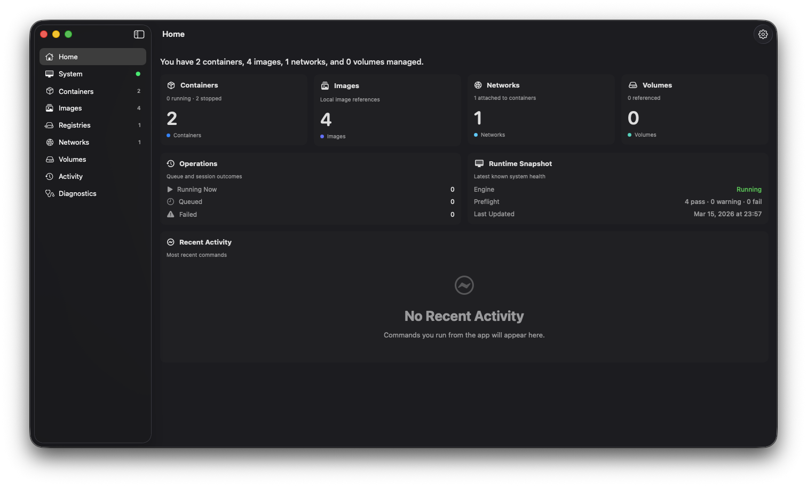
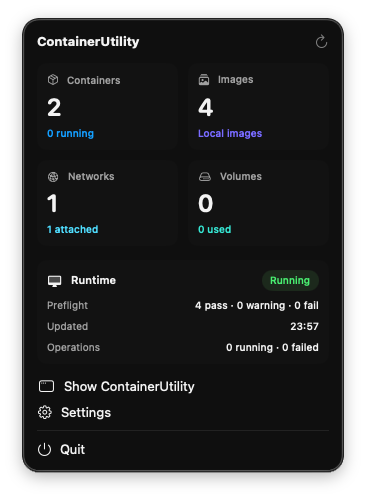

# ContainerUtility

ContainerUtility is a native macOS SwiftUI app for working with the `container` CLI through a focused desktop UI. It is designed as a lightweight utility that can live in the menu bar while giving you a full workspace for containers, images, networks, volumes, registry sessions, runtime health, recent operations, and diagnostics.

<table>
  <tr>
    <td width="78%">
      
    </td>
    <td width="22%" align="center">
      
    </td>
  </tr>
</table>

<p align="center"><em>Main workspace and the menu bar extra.</em></p>

## Features

- Native macOS app built with SwiftUI
- Menu bar extra for quick status and fast access back to the main window
- Onboarding flow for first launch and login-item setup
- Runtime health dashboard with compatibility and preflight checks
- Container management with inspect, logs, stats, and exec workflows
- Image workflows for pull, tag, push, import, export, and cleanup
- Network and volume management with relationship-aware usage details
- Registry login and logout workflows
- Activity center for queued, running, failed, and completed operations
- Diagnostics export for redacted troubleshooting bundles and summaries


## Install

### Requirements

- macOS that supports the current release build
- The `container` CLI installed and reachable from `PATH`
- A quick sanity check that `container version` works in Terminal before first launch

### Install from release

1. Download the latest `ContainerUtility.zip` from [Releases](https://github.com/erdaltoprak/ContainerUtility/releases/latest).
2. Unzip the archive.
3. Move `ContainerUtility.app` to `/Applications`.
4. Launch the app and complete onboarding.
5. If the `container` CLI is not available in your shell environment yet, fix that first and relaunch the app.

### Install from Homebrew

```bash
brew tap erdaltoprak/tap
brew install --cask erdaltoprak/tap/containerutility
```

Homebrew installs the app into `/Applications`. ContainerUtility still expects the `container` CLI to already be installed and available on `PATH`.

### Updates

- Release installs use Sparkle for in-app updates.
- Homebrew installs use the same app bundle and are marked as self-updating in the tap.
- Manual update checks are available from the app menu and Settings > About.


## Getting started for development

### Requirements

- macOS with an Xcode toolchain that supports the project deployment target
- Xcode
- The `container` CLI installed and reachable from your shell

### Steps

1. Clone the repository.
2. Make sure the `container` CLI is installed and reachable from your shell.
3. Open `ContainerUtility/ContainerUtility.xcodeproj` in Xcode.
4. Select the `ContainerUtility` target and run the app.
5. Use a Developer ID-signed release build, not an Xcode debug run, if you want to test Sparkle update behavior end to end.

The app is configured as a menu bar utility, so it may launch without a normal Dock presence depending on your current settings and onboarding state.

## Project Structure

```text
ContainerUtility/
├── README.md
├── ContainerUtility/
│   ├── ContainerUtility.xcodeproj
│   └── ContainerUtility/
│       ├── App/             # app entrypoint, scenes, settings, onboarding, shared model
│       ├── Domain/          # UI-facing domain and diagnostics models
│       ├── Features/        # containers, images, networks, volumes, activity, diagnostics, home
│       ├── Infrastructure/  # command runner, CLI adapter, refresh controller, diagnostics export
│       └── Shared/          # reusable UI building blocks
```

## License

See [License](./LICENSE.md).
